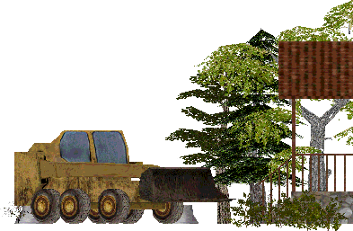

# GIDEROS_PLATFORMER_20250425

This Gideros Studio project is a 2D platformer:
- tiny-ECS
- cbump
- Tiled levels
- a menu scene, a parameters scene, 2 levels, a win scene
- scenes transition
- 1 type of enemy with various abilities
- 1 type of boss
- jump, shoot, dash, shield
- almost all cc0 assets except for the human characters (mixamo)

It is considered complete but there are some stutterings I need to improve!

The story: "Daddy goes to school to pick up little darling"

This is a personal initiative trying to help with Gideros open source project:

https://www.gideros.rocks/

Please feel free to open an Issue to ask questions about my projects here.

**Viva Gideros**!
